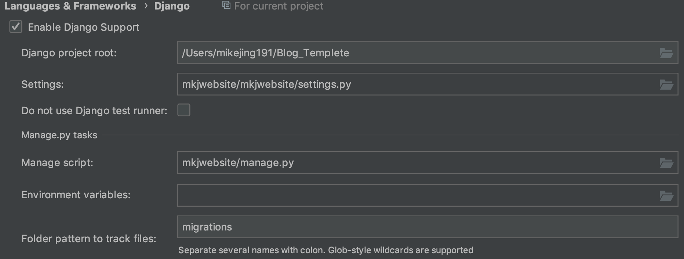

## How To Start 

1. `git clone xxxx` 到本地

2. `cd`到项目根目录，`virtualenv -p /usr/local/bin/python3 venv`创建Python3的虚拟环境

3. `. venv/bin/activate`激活虚拟环境 `deactivate` 退出

4. `pip install -r requirements.txt` 从requirement文件导入依赖

5. `cd mkjwebsite/`进去网站项目 `python manage.py runserver` 启动本地服务即可

## admin 密码

账号：mikejing 
密码：mikejing

## Pycharm设置
> 不是用Pycharm的项目如何手动设置Python参数?

1.`.gitignore`该文件已经忽略了`venv`等资源文件，我们一般暴露一个`requirement.txt`就好

2.`Templates`文件设置，右击----Make Directory as-----Template Folder 文件夹变成紫色，同时需要在Settings.py中设置查找路径

3.`venv`文件设置，右击----Make Directory as-----Exclusion 变成橙色

4.根目录设置，右击----Make Directory as-----SourcesRoot 变成蓝色

5.模板文件提示，Pythcharm----Preference-----Language&Framework-----Python Template Languages设置成Django，这样模板文件就有了模板提示

6.代码提示，资源跳转  Pythcharm----Preference-----Language&Framework-----Django------设置参数

## 已完成功能
- [x] 离线缓存、远程同步数据
- [x] 添加、删除记账类别
- [x] 通过图表统计周、月、年的记账信息
- [x] 小组件weiget 记账、查看当月账单
- [x] 开启、关闭明细详情
- [x] 登录、修改个人信息
- [x] 记账计算器实现

